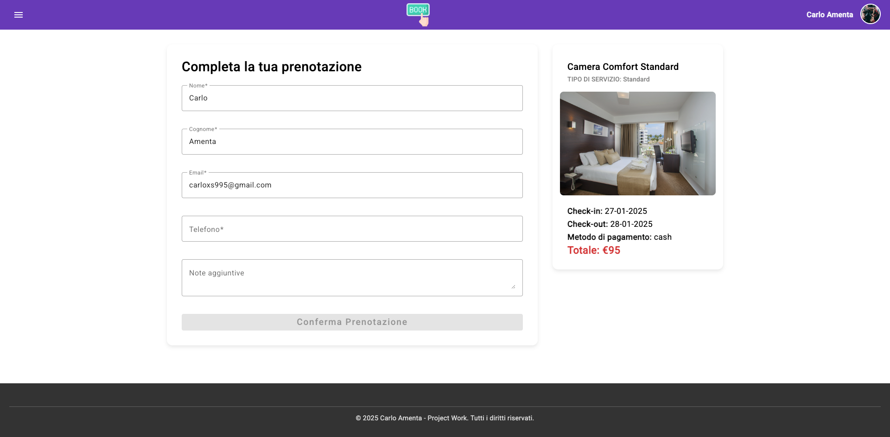

# PW Traccia 1.4 - Frontend

## Descrizione del Progetto

BookingApp è un'applicazione per la gestione delle prenotazioni alberghiere, sviluppata con **Angular 19**.
L'applicazione consente agli utenti di visualizzare le stanze disponibili, effettuare prenotazioni e gestire i dettagli delle proprie prenotazioni.

---

## HOSTING APPLICAZIONE
L'app è accessibile all'indirizzo `https://pegaso-booking.web.app/`.

## Tecnologie Utilizzate

- **Framework Frontend:** Angular 19
- **UI Library:** Angular Material
- **State Management:** RxJS
- **Routing:** Angular Router

## Struttura delle Rotte

L'applicazione utilizza le seguenti rotte:

- `/` - Pagina principale con la lista delle stanze disponibili.
- `/rooms/:id` - Dettaglio di una specifica stanza.
- `/bookings` - Lista delle prenotazioni utente.
- `/bookings/create/:roomId` - Creazione di una nuova prenotazione.
- `/bookings/edit/:bookingId` - Modifica di una prenotazione esistente.
- `/admin` - Area riservata agli amministratori.

Le rotte protette utilizzano **Auth Guards** per limitare l'accesso alle aree riservate.

Le prenotazioni saranno effettuabili solo da utente con una Login valida.

---

## Screenshot dell'Applicazione

### Homepage
La homepage permette agli utenti di cercare una stanza in base al tipo, alle date di check-in/check-out e al numero di ospiti.

---

### Dettaglio Stanza
In questa pagina vengono mostrati i dettagli della stanza selezionata, inclusi servizi, prezzo per notte e disponibilità.

---

### Nuova Prenotazione
La pagina di prenotazione consente agli utenti di inserire i propri dati personali e confermare la prenotazione.

---

### Editing Prenotazione
Questa pagina permette di modificare una prenotazione esistente, con la possibilità di cambiare le date o annullare la prenotazione.

---

### Lista Prenotazioni
Sezione dove l'utente può visualizzare tutte le prenotazioni effettuate, applicare filtri e visualizzare lo stato della prenotazione.

---

### Login
Modale di accesso per gli utenti registrati, che consente di effettuare il login utilizzando le proprie credenziali.

---

### Registrazione
Modale di registrazione consente ai nuovi utenti di creare un account per effettuare prenotazioni.

---

## Admin Area
Accessibile cliccando sopra l'avatar utente

__

### Nuova Stanza - Admin
Gli amministratori possono aggiungere nuove stanze specificando tutti i dettagli e caricando immagini.

---

### Conferma Pagamento - Admin
Interfaccia per la gestione delle prenotazioni da parte degli amministratori, che possono confermare il pagamento.

---

